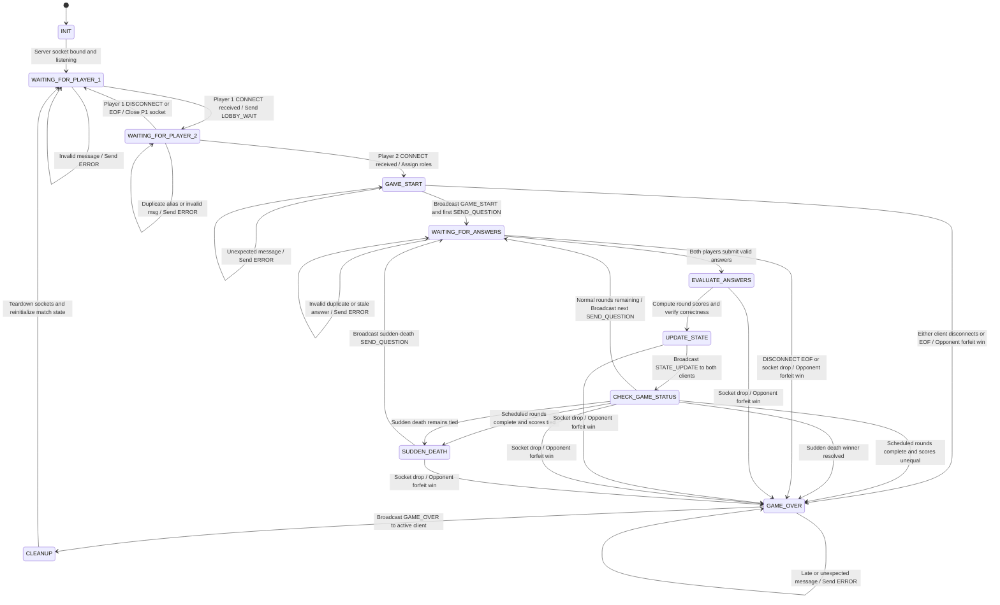

# Server-Side Finite State Machine (FSM) Specification: TriviaNet Engine

**Deliverable:** Game Engine State Machine Architecture & Formal Transitions  
**Modeling Standard:** Mermaid `stateDiagram-v2`  

---

## 1. Architectural Overview

The TriviaNet server operates as a centralized, authoritative, stateful game server. It manages two connected clients through matchmaking, synchronized round delivery, answer validation, score calculation, sudden-death resolution, and session teardown.

The FSM guarantees that:
1. No game starts without two distinct connected players.
2. Answers are accepted only during active rounds (`WAITING_FOR_ANSWERS`).
3. Early, duplicate, stale, malformed, or otherwise invalid answers return `ERROR` messages without altering the engine state.
4. Any abrupt connection loss or graceful `DISCONNECT` during gameplay results in an immediate opponent victory by forfeit.

---

## 2. Mermaid State Transition Diagram

---

## 3. Server State Definitions & Invariants

| State Name | Operational Description | Allowed Inbound Messages | Outbound Transmissions |
|---|---|---|---|
| `INIT` | Server instantiates TCP listening socket and allocates session memory. | None | None |
| `WAITING_FOR_PLAYER_1` | Lobby empty. Server listens for the first player connection. | `CONNECT` | `LOBBY_WAIT`, `ERROR` |
| `WAITING_FOR_PLAYER_2` | Player 1 registered. Server awaits an incoming second player. | `CONNECT`, `DISCONNECT` | `GAME_START`, `ERROR` |
| `GAME_START` | Match created. Roles assigned (`role=true` for P1, `role=false` for P2). | None (Internal) | `GAME_START`, `SEND_QUESTION` |
| `WAITING_FOR_ANSWERS` | Synchronized question active. Awaiting answers from both clients. | `SEND_ANSWER`, `DISCONNECT` | `ERROR` (on invalid inputs) |
| `EVALUATE_ANSWERS` | Both answers received. Engine evaluates correctness and increments scores. | None (Internal) | None |
| `UPDATE_STATE` | Assembles score deltas and updates running game stats. | None (Internal) | `STATE_UPDATE` |
| `CHECK_GAME_STATUS` | Evaluates win conditions, round counters, and sudden death. | None (Internal) | None |
| `SUDDEN_DEATH` | Active when scheduled rounds finish in a tie. Prepares tiebreaker question. | None (Internal) | `SEND_QUESTION` |
| `GAME_OVER` | Terminal game state. Final outcome resolved (Normal, Sudden Death, or Forfeit). | `DISCONNECT` | `GAME_OVER`, `ERROR` |
| `CLEANUP` | Sockets flushed and closed; session data cleared. | None (Internal) | None |

---

## 4. Formal Transition Matrix

| Source State | Trigger / Event | Guard Condition | Target State | Action / Side Effect |
|---|---|---|---|---|
| `INIT` | Socket bind & listen | Port available | `WAITING_FOR_PLAYER_1` | Allocate game buffers. |
| `WAITING_FOR_PLAYER_1` | `CONNECT` received | Valid alias length | `WAITING_FOR_PLAYER_2` | Store P1 alias; send `LOBBY_WAIT`. |
| `WAITING_FOR_PLAYER_1` | Malformed packet | Invalid schema | `WAITING_FOR_PLAYER_1` | Send `ERROR: MALFORMED_MESSAGE`. |
| `WAITING_FOR_PLAYER_1` | TCP EOF / RST | Remote socket dropped | `WAITING_FOR_PLAYER_1` | Close P1 socket handle. |
| `WAITING_FOR_PLAYER_2` | `CONNECT` received | Alias != P1 alias | `GAME_START` | Store P2 alias; trigger start. |
| `WAITING_FOR_PLAYER_2` | `CONNECT` received | Alias == P1 alias | `WAITING_FOR_PLAYER_2` | Send `ERROR: ALIAS_TAKEN`. |
| `WAITING_FOR_PLAYER_2` | `DISCONNECT` or EOF | From Player 1 | `WAITING_FOR_PLAYER_1` | Close P1 socket; reset lobby. |
| `GAME_START` | Engine ready | Sockets healthy | `WAITING_FOR_ANSWERS` | Send `GAME_START` and Q1 `SEND_QUESTION`. |
| `GAME_START` | P1 or P2 drop / RST | Connection lost | `GAME_OVER` | Set `end_reason="FORFEIT"`. |
| `WAITING_FOR_ANSWERS` | First `SEND_ANSWER` | Matches active Q# | `WAITING_FOR_ANSWERS` | Record answer; continue waiting for peer. |
| `WAITING_FOR_ANSWERS` | Duplicate answer | Player already answered | `WAITING_FOR_ANSWERS` | Send `ERROR: DUPLICATE_ANSWER`. |
| `WAITING_FOR_ANSWERS` | Stale answer | Q# != active Q# | `WAITING_FOR_ANSWERS` | Send `ERROR: STALE_QUESTION`. |
| `WAITING_FOR_ANSWERS` | Second `SEND_ANSWER` | Both answers in | `EVALUATE_ANSWERS` | Advance engine to score calculation. |
| `WAITING_FOR_ANSWERS` | `DISCONNECT` or RST | Either player drops | `GAME_OVER` | Set `winner_alias=peer`, `reason="FORFEIT"`. |
| `EVALUATE_ANSWERS` | Evaluation complete | Automatic | `UPDATE_STATE` | Increment scores; build payload. |
| `UPDATE_STATE` | State broadcast | Automatic | `CHECK_GAME_STATUS` | Send `STATE_UPDATE` to P1 and P2. |
| `CHECK_GAME_STATUS` | Round evaluation | Normal rounds remaining | `WAITING_FOR_ANSWERS` | Increment Q#; send `SEND_QUESTION`. |
| `CHECK_GAME_STATUS` | Round evaluation | Rounds done & scores tied | `SUDDEN_DEATH` | Set `is_sudden_death=true`. |
| `CHECK_GAME_STATUS` | Round evaluation | Rounds done & score delta | `GAME_OVER` | Set `end_reason="NORMAL"`. |
| `CHECK_GAME_STATUS` | Sudden-death eval | Still tied | `SUDDEN_DEATH` | Prepare next tiebreaker question. |
| `CHECK_GAME_STATUS` | Sudden-death eval | Winner resolved | `GAME_OVER` | Set `end_reason="SUDDEN_DEATH"`. |
| `SUDDEN_DEATH` | Ready | Sockets open | `WAITING_FOR_ANSWERS` | Send tiebreaker `SEND_QUESTION`. |
| `GAME_OVER` | Winner compiled | Connected peer alive | `CLEANUP` | Send framed `GAME_OVER` payload. |
| `CLEANUP` | Sockets closed | Memory wiped | `WAITING_FOR_PLAYER_1` | Return to listening state for next match. |

---

## 5. Fault-Tolerance, Edge Cases & Error Handling

1. **Out-of-Order Answers / Stale Packets:**
   If a delayed packet for Question 1 arrives while the server is in Question 2, the server validates `payload.question_number == active_question_number`. If unequal, it transmits `ERROR: STALE_QUESTION` and discards the input without altering game state.
2. **Duplicate Submissions:**
   A player who spams multiple answer selections for a single question receives `ERROR: DUPLICATE_ANSWER`. The engine preserves their initial submission.
3. **Mid-Game Disconnect / Forfeit Recovery:**
   If either client disconnects during active gameplay (states `GAME_START` through `CHECK_GAME_STATUS`), the engine transitions directly to `GAME_OVER`. The surviving player receives a `GAME_OVER` packet containing `end_reason: "FORFEIT"` and is credited with the victory.
4. **Clean Session Reinitialization:**
   Upon transitioning through `CLEANUP`, all client references are released, open sockets are closed, round and score counters reset to zero, and the server returns to `WAITING_FOR_PLAYER_1`.