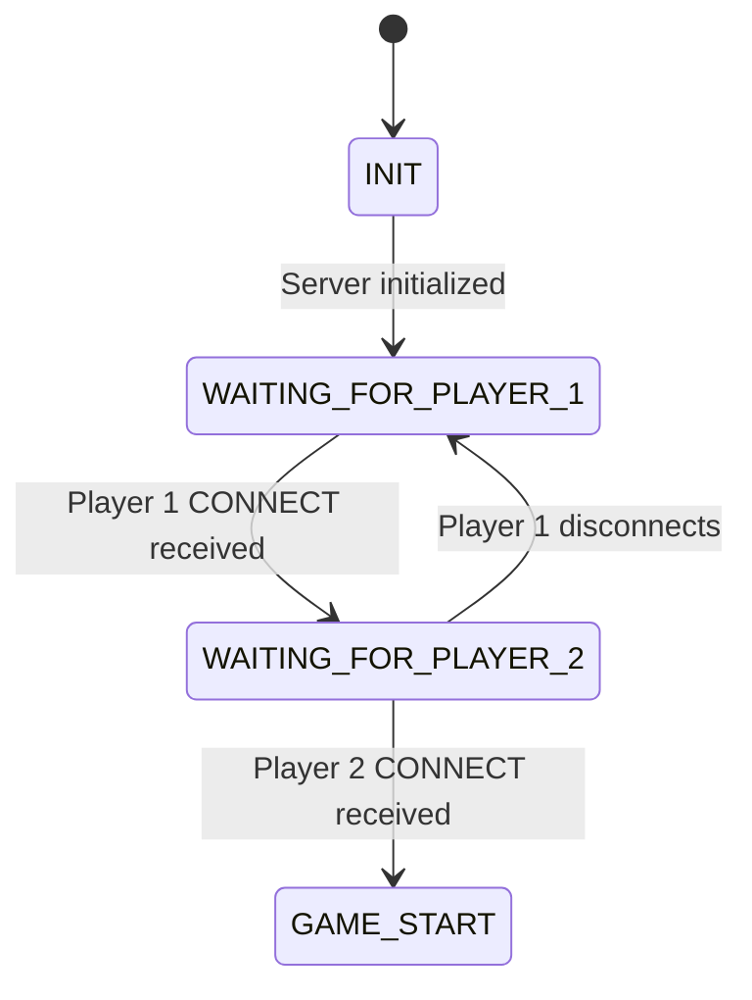

```mermaid
stateDiagram-v2
    [*] --> INIT

    INIT --> WAITING_FOR_PLAYER_1: Server initialized

    WAITING_FOR_PLAYER_1 --> WAITING_FOR_PLAYER_2: Player 1 CONNECT received
    WAITING_FOR_PLAYER_2 --> WAITING_FOR_PLAYER_1: Player 1 disconnects
    WAITING_FOR_PLAYER_2 --> GAME_START: Player 2 CONNECT received

```